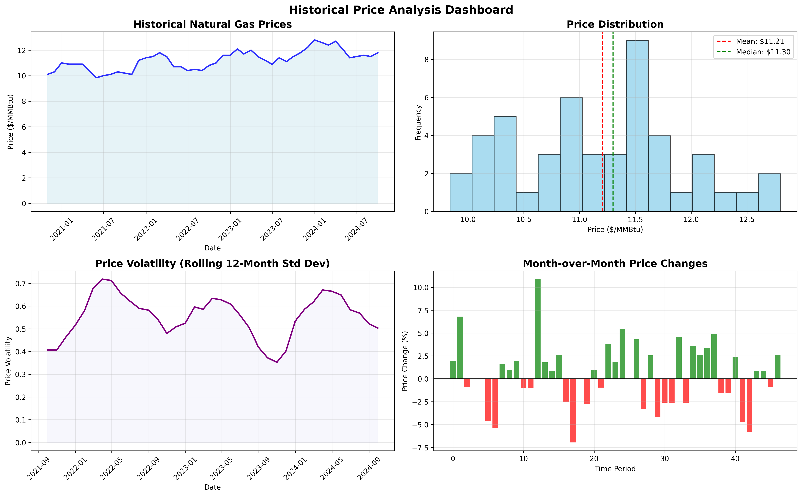
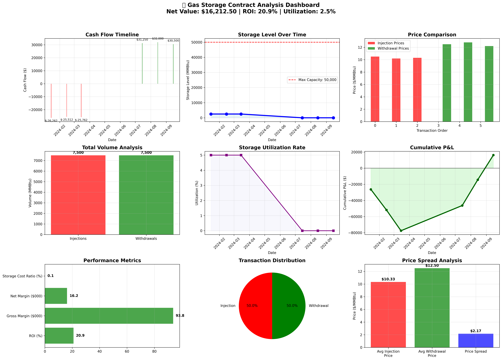
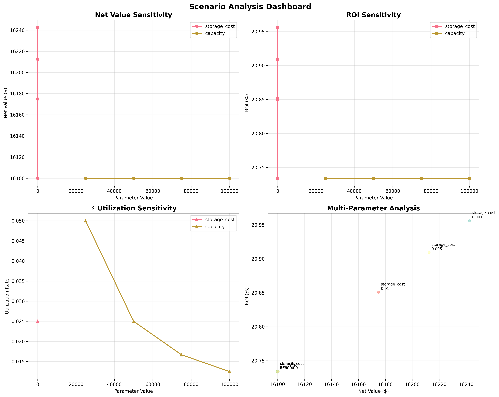

```md
# 📊 Finance Analytics Project (JPMorgan Inspired)

[](https://www.python.org/)  
[](LICENSE)  
[]()

A **finance analytics & risk modeling project** that covers **loan default prediction, FICO score categorization, natural gas storage valuation, and scenario analysis**.  
Inspired by quantitative finance tasks in the **JPMorgan** domain.

---

## 📂 Repository Structure

```

├── FICO_scores_to_categorical_data.py     # Credit score categorization
├── gas_storage_valuation_model.py         # Natural gas storage valuation
├── loan_estimation.py                     # Loan default estimation model
├── market_data_demonstrate.py             # Market data demonstration
│
├── Task 3 and 4_Loan_Data.csv             # Loan dataset
├── Loan_Data_with_PD_EL.csv               # Processed loan dataset
├── Nat_Gas.csv                            # Natural gas price data
├── fico_rating_map.csv                    # Mapping file for FICO ratings
│
├── fico_pd_buckets.png                    # Visualization: FICO score buckets
├── gas_storage_analysis.png               # Visualization: Gas storage analysis
├── historical_price_analysis.png          # Visualization: Historical gas price
├── scenario_analysis.png                  # Visualization: Scenario analysis
│
└── README.md                              # Project documentation

````

---

## 🎯 Project Objectives

✔ **Loan Default Risk Estimation**  
- Map **FICO scores** into probability-of-default (PD) categories  
- Estimate expected loss (EL) using loan data  

✔ **Natural Gas Market Valuation**  
- Analyze **historical gas prices**  
- Build a **storage valuation model**  

✔ **Scenario Analysis**  
- Simulate “what-if” conditions for risk management  
- Visualize the impact of changes in market conditions  

---

## 🚀 Getting Started

### 1️⃣ Clone the Repository
```bash
git clone https://github.com/Supriti2206/FINANCE-ANALYTICS-PROJECT-BY-JPMorgan.git
cd FINANCE-ANALYTICS-PROJECT-BY-JPMorgan
````

### 2️⃣ Create Virtual Environment (Optional)

```bash
python -m venv venv
# Activate
venv\Scripts\activate       # Windows
source venv/bin/activate    # macOS / Linux
```

### 3️⃣ Install Dependencies

```bash
pip install -r requirements.txt
```

*(If requirements.txt isn’t created yet, manually install: `pandas`, `numpy`, `matplotlib`, `scikit-learn`.)*

### 4️⃣ Run Scripts

```bash
python loan_estimation.py
python gas_storage_valuation_model.py
python market_data_demonstrate.py
```

---

## 📊 Key Visualizations

| Visualization                                           | Description                                  |
| ------------------------------------------------------- | -------------------------------------------- |
|                     | Mapping of FICO scores to PD categories      |
|  | Analysis of past gas market trends           |
|                 | Storage valuation under different conditions |
|              | What-if scenario impacts                     |

---

## 🛠️ Tech Stack

* **Python 3.x**
* `pandas`, `numpy` → data processing
* `matplotlib`, `seaborn` → visualization
* `scikit-learn` → modeling (PD / risk models)

---

## 🧩 Future Improvements

* Add **Monte Carlo simulations** for stress testing
* Build an **interactive dashboard** (Streamlit / Plotly Dash)
* Integrate **real-time financial data APIs**
* Expand scope beyond loans & natural gas

---

## 🤝 Contributing

Pull requests are welcome!

1. Fork the repo
2. Create a branch (`feature-new`)
3. Commit changes (`git commit -m "Added feature"`)
4. Push & open a PR

---

## 📜 License

This project is licensed under the **MIT License** – see [LICENSE](LICENSE) file for details.

---

```txt
pandas==2.2.2
numpy==1.26.4
matplotlib==3.9.2
scikit-learn==1.5.2
seaborn==0.13.2
scipy==1.14.1
```

---

### 📌 Why these?

* **pandas** → handling CSV loan/gas datasets
* **numpy** → math & matrix operations
* **matplotlib** → plots & figures (like your PNG outputs)
* **scikit-learn** → probability of default (PD), risk models
* **seaborn** → advanced statistical plots (if you add more visuals)
* **scipy** → useful for optimization & statistical functions (scenario/valuation models)

---

👉 If you want, I can also include **optional libraries** you might add later:

* `statsmodels` (for probability/stat analysis)
* `plotly` (for interactive visualizations)
* `jupyter` (if you want to run notebooks instead of scripts)

---

✨ *Developed with passion for data-driven finance analytics* ✨

```

---


